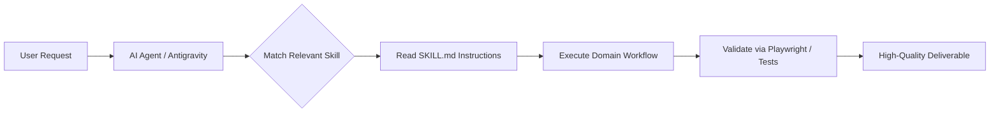

# Agent Skills Workspace 🚀

> **Production-Grade AI Agent Skills Library & Automated Browser Testing Suite**  
> Designed for **Google Antigravity**, **Claude Code**, and next-generation autonomous coding agents.

---

[](#-skills-catalog)
[](#-agent-mode--usage)
[](#-playwright-automation-suite)
[](#-prerequisites--setup)
[](#-license)

---

## ⚡ Agent Instructions (Antigravity Sidebar / Agent Mode)

> [!IMPORTANT]
> **RUN THIS WORKSPACE IN AGENT MODE / ANTIGRAVITY SIDEBAR**
>
> 1. **Skill Discovery**: This repository contains a modular library of 130+ specialized agent skills located in [`.agents/skills/`](file:///c:/xampp/htdocs/YEAR%203/SE/Skills/.agents/skills) and [`.claude/skills/`](file:///c:/xampp/htdocs/YEAR%203/SE/Skills/.claude/skills). Agents must inspect and read the relevant skill's `SKILL.md` before executing domain tasks.
> 2. **Playwright Initialization**: Run `npm run setup` in your terminal to install dependencies and download browser binaries for the built-in Playwright testing suite.

---

## 📋 Table of Contents

- [Overview](#-overview)
- [Quick Start & Setup](#-quick-start--setup)
- [Repository Architecture](#-repository-architecture)
- [Playwright Automation Suite](#-playwright-automation-suite)
- [Skills Catalog](#-skills-catalog)
  - [🎨 UI/UX, Design & Frontend Experience](#-uiux-design--frontend-experience)
  - [⚛️ Modern Frontend Frameworks](#️-modern-frontend-frameworks)
  - [⚙️ Backend, Systems & Languages](#️-backend-systems--languages)
  - [🏛️ Software Architecture & Cloud Infrastructure](#️-software-architecture--cloud-infrastructure)
  - [🧠 AI Agents, LLMs & RAG](#-ai-agents-llms--rag)
  - [🧪 Testing, QA & Debugging](#-testing-qa--debugging)
  - [🛡️ Security, DevSecOps & Penetration Testing](#️-security-devsecops--penetration-testing)
  - [📊 Databases, Big Data & Analytics](#-databases-big-data--analytics)
  - [📱 Mobile & Game Development](#-mobile--game-development)
  - [🔍 External Integrations & APIs](#-external-integrations--apis)
  - [📈 Product, Strategy & Growth Copy](#-product-strategy--growth-copy)
- [How Skills Work](#-how-skills-work)
- [Adding New Skills](#-adding-new-skills)
- [License](#-license)

---

## 🌟 Overview

The **Skills Workspace** is a unified agent capabilities repository. Instead of generic LLM outputs, skills supply autonomous coding agents with curated recipes, checklists, code patterns, and deep domain methodologies.

Key benefits:
- **Instant Agent Specialization**: Transform general coding agents into senior architects, penetration testers, design system leads, or performance engineers on demand.
- **Automated Browser Verification**: Integrated Playwright browser automation with automatic local dev-server detection, screenshot capture, and responsive UX testing.
- **Cross-Platform Compatibility**: Fully compatible with Google Antigravity IDE/CLI (`.agents/skills`), Claude Code (`.claude/skills`), Cursor, and Windsurf workflows.

---

## 🚀 Quick Start & Setup

### Prerequisites

- **Node.js**: `v20.0.0` or later
- **npm**: `v10.0.0` or later
- **Git**

### 1. Initialize Playwright & Browser Binaries

To enable the autonomous browser testing skill ([`playwright-skill`](file:///c:/xampp/htdocs/YEAR%203/SE/Skills/.agents/skills/playwright-skill)), run:

```bash
# Install dependencies and download Chromium
npm run setup
```

If you need cross-browser testing across Firefox and WebKit:

```bash
# Install Chromium, Firefox, and WebKit binaries
npm run setup:playwright:all
```

### 2. Available NPM Scripts

| Script | Command | Purpose |
| :--- | :--- | :--- |
| `npm run setup` | `npm --prefix .agents/skills/playwright-skill run setup` | Install Playwright dependencies and Chromium binary |
| `npm run setup:playwright` | `npm --prefix .agents/skills/playwright-skill run setup` | Alias for standard Playwright setup |
| `npm run setup:playwright:all` | `npm --prefix .agents/skills/playwright-skill run install-all-browsers` | Install all supported browsers (Chromium, Firefox, WebKit) |
| `npm run test:playwright` | `node .agents/skills/playwright-skill/run.js` | Execute the Playwright test runner |

---

## 📁 Repository Architecture

```text
Skills/
├── .agents/
│   └── skills/                  # Primary workspace skills library (135+ skills)
│       ├── playwright-skill/    # Built-in browser automation engine
│       ├── ui-ux-pro-max/       # Design system & UI intelligence
│       ├── senior-architect/    # Systems design & architectural patterns
│       └── ...                  # 130+ additional specialized skills
├── .claude/
│   └── skills/                  # Curated skills mirror for Claude Code compatibility
├── package.json                 # Project scripts and Playwright shortcuts
├── skills-lock.json             # Upstream skill provenance and sha256 checksums
└── README.md                    # Workspace guide and skills documentation
```

---

## 🎭 Playwright Automation Suite

The workspace includes [`playwright-skill`](file:///c:/xampp/htdocs/YEAR%203/SE/Skills/.agents/skills/playwright-skill), enabling AI agents to autonomously:
- **Detect running dev servers** (Vite, Next.js, Webpack, PHP, etc.) on `localhost`.
- **Capture responsive screenshots** across desktop, tablet, and mobile viewports.
- **Run automated UI validation**, form submission flows, and link-checking passes.
- **Execute end-to-end regression tests** without manual browser interaction.

### How an Agent Uses Playwright:
1. Agent detects running localhost servers automatically.
2. Agent writes dynamic test scripts targeting specific views or interactive flows.
3. Agent executes the script via `node .agents/skills/playwright-skill/run.js <script.js>` and reviews results.

---

## 📚 Skills Catalog

Skills are organized into cohesive domains. Each skill folder contains a detailed `SKILL.md` with operational guidelines, step-by-step instructions, and code references.

### 🎨 UI/UX, Design & Frontend Experience
| Skill | Description |
| :--- | :--- |
| [`ui-ux-pro-max`](file:///c:/xampp/htdocs/YEAR%203/SE/Skills/.agents/skills/ui-ux-pro-max) | Advanced UI/UX design intelligence: 79 design styles, 192 palettes, 74 font pairings, 119 UX guidelines. |
| [`frontend-design`](file:///c:/xampp/htdocs/YEAR%203/SE/Skills/.agents/skills/frontend-design) | Senior frontend designer-engineer principles: layout, typography, micro-interactions, and visual flair. |
| [`impeccable`](file:///c:/xampp/htdocs/YEAR%203/SE/Skills/.agents/skills/impeccable) | Comprehensive UI polishing: UX audits, layout fixes, visual hierarchy, responsive refinement, and cognitive load reduction. |
| [`design-system`](file:///c:/xampp/htdocs/YEAR%203/SE/Skills/.agents/skills/design-system) | Three-layer design token architecture (primitive → semantic → component), typography scales, and UI tokens. |
| [`ui-styling`](file:///c:/xampp/htdocs/YEAR%203/SE/Skills/.agents/skills/ui-styling) | Accessible component implementation with shadcn/ui, Radix primitives, and Tailwind CSS. |
| [`3d-web-experience`](file:///c:/xampp/htdocs/YEAR%203/SE/Skills/.agents/skills/3d-web-experience) | Interactive 3D web experiences using Three.js, React Three Fiber, Spline, and WebGL shaders. |
| [`scroll-experience`](file:///c:/xampp/htdocs/YEAR%203/SE/Skills/.agents/skills/scroll-experience) | Cinematic, interactive scroll storytelling, parallax motion, and GSAP-driven narrative landing pages. |
| [`claude-d3js-skill`](file:///c:/xampp/htdocs/YEAR%203/SE/Skills/.agents/skills/claude-d3js-skill) | Interactive, publication-quality data visualisations and dynamic charts built with D3.js. |
| [`banner-design`](file:///c:/xampp/htdocs/YEAR%203/SE/Skills/.agents/skills/banner-design) | Multi-platform banner generation across social media, display ads, hero banners, and print assets. |
| [`canvas-design`](file:///c:/xampp/htdocs/YEAR%203/SE/Skills/.agents/skills/canvas-design) | Computational visual design philosophies translated into programmatic graphics and exportable visuals. |
| [`algorithmic-art`](file:///c:/xampp/htdocs/YEAR%203/SE/Skills/.agents/skills/algorithmic-art) | Generative art algorithms, computational aesthetics, and interactive HTML5/WebGL canvas viewers. |
| [`slides`](file:///c:/xampp/htdocs/YEAR%203/SE/Skills/.agents/skills/slides) | High-impact interactive HTML presentations, Chart.js integrations, and executive pitch decks. |

### ⚛️ Modern Frontend Frameworks
| Skill | Description |
| :--- | :--- |
| [`react-patterns`](file:///c:/xampp/htdocs/YEAR%203/SE/Skills/.agents/skills/react-patterns) | Modern React 19 patterns: custom hooks, component composition, server components, and performance optimization. |
| [`react-best-practices`](file:///c:/xampp/htdocs/YEAR%203/SE/Skills/.agents/skills/react-best-practices) | Performance optimization guidelines for React and Next.js applications directly maintained with Vercel standards. |
| [`nextjs-app-router-patterns`](file:///c:/xampp/htdocs/YEAR%203/SE/Skills/.agents/skills/nextjs-app-router-patterns) | Next.js 14/15 App Router architecture, Server Actions, streaming SSR, and parallel route patterns. |
| [`nextjs-best-practices`](file:///c:/xampp/htdocs/YEAR%203/SE/Skills/.agents/skills/nextjs-best-practices) | Production guidelines for data fetching, caching strategies, and App Router route handlers. |
| [`tailwind-patterns`](file:///c:/xampp/htdocs/YEAR%203/SE/Skills/.agents/skills/tailwind-patterns) | Tailwind CSS v4 patterns: CSS-first configuration, theme variables, container queries, and fluid scaling. |
| [`typescript-expert`](file:///c:/xampp/htdocs/YEAR%203/SE/Skills/.agents/skills/typescript-expert) | Type-level programming, strict generics, AST transformations, and enterprise monorepo management. |
| [`javascript-pro`](file:///c:/xampp/htdocs/YEAR%203/SE/Skills/.agents/skills/javascript-pro) | ES6+ idioms, modern asynchronous flows, event loop tuning, and browser/Node.js compatibility. |

### ⚙️ Backend, Systems & Languages
| Skill | Description |
| :--- | :--- |
| [`backend-dev-guidelines`](file:///c:/xampp/htdocs/YEAR%203/SE/Skills/.agents/skills/backend-dev-guidelines) | Senior backend engineering constraints: Express middleware, Prisma/ORM patterns, routing, and controller layers. |
| [`nodejs-best-practices`](file:///c:/xampp/htdocs/YEAR%203/SE/Skills/.agents/skills/nodejs-best-practices) | Production Node.js architecture: resilient error handling, clustering, streaming I/O, and secure microservices. |
| [`python-pro`](file:///c:/xampp/htdocs/YEAR%203/SE/Skills/.agents/skills/python-pro) | Modern Python 3.12+ idioms, `uv`, `ruff`, Pydantic V2, typing, and async performance tuning. |
| [`fastapi-pro`](file:///c:/xampp/htdocs/YEAR%203/SE/Skills/.agents/skills/fastapi-pro) | High-performance asynchronous APIs using FastAPI, SQLAlchemy 2.0, WebSockets, and Pydantic V2. |
| [`django-pro`](file:///c:/xampp/htdocs/YEAR%203/SE/Skills/.agents/skills/django-pro) | Production Django 5.x architecture: async views, Django REST Framework, Celery queues, and Channels. |
| [`golang-pro`](file:///c:/xampp/htdocs/YEAR%203/SE/Skills/.agents/skills/golang-pro) | Idiomatic Go 1.21+, memory profiling, goroutines, clean architecture, and cloud-native services. |
| [`go-concurrency-patterns`](file:///c:/xampp/htdocs/YEAR%203/SE/Skills/.agents/skills/go-concurrency-patterns) | Concurrency patterns with channels, worker pools, mutexes, fan-in/fan-out, and context cancellation. |
| [`rust-pro`](file:///c:/xampp/htdocs/YEAR%203/SE/Skills/.agents/skills/rust-pro) | Rust 1.75+ systems programming, zero-cost abstractions, Tokio async runtime, and robust error management. |
| [`cpp-pro`](file:///c:/xampp/htdocs/YEAR%203/SE/Skills/.agents/skills/cpp-pro) | Modern C++ (C++20/23): RAII, smart pointers, template metaprogramming, and memory safety. |

### 🏛️ Software Architecture & Cloud Infrastructure
| Skill | Description |
| :--- | :--- |
| [`senior-architect`](file:///c:/xampp/htdocs/YEAR%203/SE/Skills/.agents/skills/senior-architect) | High-level system design: scalability bottlenecks, trade-off matrices, and strategic technical roadmaps. |
| [`architecture-patterns`](file:///c:/xampp/htdocs/YEAR%203/SE/Skills/.agents/skills/architecture-patterns) | Clean Architecture, Hexagonal (Ports & Adapters), and Domain-Driven Design (DDD) blueprints. |
| [`microservices-patterns`](file:///c:/xampp/htdocs/YEAR%203/SE/Skills/.agents/skills/microservices-patterns) | Service boundaries, distributed sagas, CQRS, API gateways, circuit breakers, and event streaming. |
| [`event-sourcing-architect`](file:///c:/xampp/htdocs/YEAR%203/SE/Skills/.agents/skills/event-sourcing-architect) | Event sourcing and CQRS: event stores, projection builders, immutable audit logs, and eventual consistency. |
| [`architecture-decision-records`](file:///c:/xampp/htdocs/YEAR%203/SE/Skills/.agents/skills/architecture-decision-records) | Formal ADR creation and governance capturing technical context, options, consequences, and decisions. |
| [`aws-serverless`](file:///c:/xampp/htdocs/YEAR%203/SE/Skills/.agents/skills/aws-serverless) | Production AWS Lambda, API Gateway, DynamoDB single-table design, EventBridge, and SAM/CDK pipelines. |
| [`docker-expert`](file:///c:/xampp/htdocs/YEAR%203/SE/Skills/.agents/skills/docker-expert) | Containerization best practices, multi-stage minimal builds, non-root security, and Docker Compose environments. |
| [`kubernetes-architect`](file:///c:/xampp/htdocs/YEAR%203/SE/Skills/.agents/skills/kubernetes-architect) | Enterprise cloud-native orchestration: GitOps (ArgoCD/Flux), Helm charts, ingress, and auto-scaling. |
| [`terraform-specialist`](file:///c:/xampp/htdocs/YEAR%203/SE/Skills/.agents/skills/terraform-specialist) | Infrastructure-as-Code with Terraform & OpenTofu: modular architectures, remote state, and drift mitigation. |
| [`deployment-procedures`](file:///c:/xampp/htdocs/YEAR%203/SE/Skills/.agents/skills/deployment-procedures) | Zero-downtime blue/green & canary deployments, automated health-checks, and rapid rollback runbooks. |
| [`observability-engineer`](file:///c:/xampp/htdocs/YEAR%203/SE/Skills/.agents/skills/observability-engineer) | Telemetry pipelines: OpenTelemetry, Prometheus metrics, structured logging, and Grafana dashboards. |
| [`distributed-tracing`](file:///c:/xampp/htdocs/YEAR%203/SE/Skills/.agents/skills/distributed-tracing) | Distributed tracing with Jaeger, Tempo, and OpenTelemetry across distributed microservices. |
| [`slo-implementation`](file:///c:/xampp/htdocs/YEAR%203/SE/Skills/.agents/skills/slo-implementation) | Defining and monitoring Service Level Indicators (SLIs), Service Level Objectives (SLOs), and error budgets. |

### 🧠 AI Agents, LLMs & RAG
| Skill | Description |
| :--- | :--- |
| [`ai-agents-architect`](file:///c:/xampp/htdocs/YEAR%203/SE/Skills/.agents/skills/ai-agents-architect) | Autonomous AI agent architectures: ReAct reasoning, tool-use execution, memory systems, and multi-agent coordination. |
| [`langgraph`](file:///c:/xampp/htdocs/YEAR%203/SE/Skills/.agents/skills/langgraph) | Stateful multi-actor workflows, cycles, checkpoint persistence, and human-in-the-loop agent workflows. |
| [`rag-engineer`](file:///c:/xampp/htdocs/YEAR%203/SE/Skills/.agents/skills/rag-engineer) | Production RAG engineering: hybrid search (dense + sparse), reranking, chunking optimization, and metadata routing. |
| [`rag-implementation`](file:///c:/xampp/htdocs/YEAR%203/SE/Skills/.agents/skills/rag-implementation) | Hands-on RAG workflow: vector embedding pipelines, vector DB ingestion, and retrieval context injection. |
| [`vector-database-engineer`](file:///c:/xampp/htdocs/YEAR%203/SE/Skills/.agents/skills/vector-database-engineer) | Vector database indexing strategies using Pinecone, Qdrant, Milvus, Weaviate, and PostgreSQL `pgvector`. |
| [`prompt-engineering`](file:///c:/xampp/htdocs/YEAR%203/SE/Skills/.agents/skills/prompt-engineering) | Structured prompt design: few-shot elicitation, reasoning chains, structured JSON generation, and prompt debugging. |
| [`prompt-caching`](file:///c:/xampp/htdocs/YEAR%203/SE/Skills/.agents/skills/prompt-caching) | LLM prompt caching strategies for Anthropic and Cache-Augmented Generation (CAG) to slash latency and costs. |
| [`langfuse`](file:///c:/xampp/htdocs/YEAR%203/SE/Skills/.agents/skills/langfuse) | Open-source LLM observability: traces, prompt versioning, user feedback loops, and token cost tracking. |
| [`agent-evaluation`](file:///c:/xampp/htdocs/YEAR%203/SE/Skills/.agents/skills/agent-evaluation) | Behavioral benchmarks, reliability evaluations, and unit tests for LLM agents on non-deterministic tasks. |
| [`mcp-builder`](file:///c:/xampp/htdocs/YEAR%203/SE/Skills/.agents/skills/mcp-builder) | Model Context Protocol (MCP) server creation: exposing tools, schemas, and external resources cleanly to LLMs. |

### 🧪 Testing, QA & Debugging
| Skill | Description |
| :--- | :--- |
| [`playwright-skill`](file:///c:/xampp/htdocs/YEAR%203/SE/Skills/.agents/skills/playwright-skill) | Autonomous Playwright browser testing: local dev server detection, visual checks, and end-to-end flows. |
| [`browser-automation`](file:///c:/xampp/htdocs/YEAR%203/SE/Skills/.agents/skills/browser-automation) | Resilient web scraping and browser automation: selector strategies, wait conditions, and anti-bot mitigation. |
| [`e2e-testing-patterns`](file:///c:/xampp/htdocs/YEAR%203/SE/Skills/.agents/skills/e2e-testing-patterns) | Deterministic, flake-resistant E2E test suites with realistic fixtures, mocking, and parallel execution. |
| [`test-driven-development`](file:///c:/xampp/htdocs/YEAR%203/SE/Skills/.agents/skills/test-driven-development) | Strict red-green-refactor TDD workflows for robust software design before implementation. |
| [`systematic-debugging`](file:///c:/xampp/htdocs/YEAR%203/SE/Skills/.agents/skills/systematic-debugging) | Root-cause analysis frameworks: hypothesis generation, minimal reproduction cases, and diagnostic logging. |
| [`test-fixing`](file:///c:/xampp/htdocs/YEAR%203/SE/Skills/.agents/skills/test-fixing) | Targeted triage and resolution strategies to eliminate flaky, broken, and unmaintained test suites. |
| [`lint-and-validate`](file:///c:/xampp/htdocs/YEAR%203/SE/Skills/.agents/skills/lint-and-validate) | Mandatory post-change validation procedures: static analysis, linting passes, and zero-warning enforcement. |
| [`code-review-checklist`](file:///c:/xampp/htdocs/YEAR%203/SE/Skills/.agents/skills/code-review-checklist) | Comprehensive code review criteria: maintainability, security risks, concurrency gotchas, and performance regressions. |

### 🛡️ Security, DevSecOps & Penetration Testing
| Skill | Description |
| :--- | :--- |
| [`backend-security-coder`](file:///c:/xampp/htdocs/YEAR%203/SE/Skills/.agents/skills/backend-security-coder) | Secure backend coding: SQL injection prevention, input sanitization, safe deserialization, and HMAC verification. |
| [`frontend-security-coder`](file:///c:/xampp/htdocs/YEAR%203/SE/Skills/.agents/skills/frontend-security-coder) | Client-side security: XSS mitigation, Content Security Policy (CSP), CSRF defenses, and secure DOM manipulation. |
| [`top-web-vulnerabilities`](file:///c:/xampp/htdocs/YEAR%203/SE/Skills/.agents/skills/top-web-vulnerabilities) | Comprehensive encyclopedia of top 100 web vulnerabilities, attack vectors, and step-by-step remediation recipes. |
| [`ethical-hacking-methodology`](file:///c:/xampp/htdocs/YEAR%203/SE/Skills/.agents/skills/ethical-hacking-methodology) | Complete penetration testing lifecycle: reconnaissance, scanning, exploitation, post-exploitation, and reporting. |
| [`burp-suite-testing`](file:///c:/xampp/htdocs/YEAR%203/SE/Skills/.agents/skills/burp-suite-testing) | HTTP traffic interception, parameter tampering, intruder attacks, and automated security scans with Burp Suite. |
| [`cloud-penetration-testing`](file:///c:/xampp/htdocs/YEAR%203/SE/Skills/.agents/skills/cloud-penetration-testing) | AWS, Azure, and GCP security assessments: IAM misconfigurations, privilege escalation, and S3 bucket exposures. |
| [`linux-privilege-escalation`](file:///c:/xampp/htdocs/YEAR%203/SE/Skills/.agents/skills/linux-privilege-escalation) | Linux security audits: SUID binaries, cron jobs, kernel exploits, and sudo permissions misconfigurations. |
| [`pci-compliance`](file:///c:/xampp/htdocs/YEAR%203/SE/Skills/.agents/skills/pci-compliance) | PCI DSS compliance principles for cardholder data environments, encryption, tokenization, and audit trails. |

### 📊 Databases, Big Data & Analytics
| Skill | Description |
| :--- | :--- |
| [`database-architect`](file:///c:/xampp/htdocs/YEAR%203/SE/Skills/.agents/skills/database-architect) | Database engine selection, normalization vs denormalization, partitioning, and high-throughput schemas. |
| [`postgres-best-practices`](file:///c:/xampp/htdocs/YEAR%203/SE/Skills/.agents/skills/postgres-best-practices) | PostgreSQL query optimization, connection pooling with PgBouncer, EXPLAIN ANALYZE tuning, and indexes. |
| [`sql-pro`](file:///c:/xampp/htdocs/YEAR%203/SE/Skills/.agents/skills/sql-pro) | Advanced SQL: window functions, recursive CTEs, transaction isolation levels, and OLAP analytics. |
| [`data-engineer`](file:///c:/xampp/htdocs/YEAR%203/SE/Skills/.agents/skills/data-engineer) | Data warehouse pipelines: ETL/ELT architectures, Apache Spark processing, and lakehouse storage. |
| [`dbt-transformation-patterns`](file:///c:/xampp/htdocs/YEAR%203/SE/Skills/.agents/skills/dbt-transformation-patterns) | dbt models, incremental strategies, snapshot auditing, and schema testing in modern data warehouses. |
| [`airflow-dag-patterns`](file:///c:/xampp/htdocs/YEAR%203/SE/Skills/.agents/skills/airflow-dag-patterns) | Production Apache Airflow DAGs: custom operators, dynamic task generation, task sensors, and backfills. |

### 📱 Mobile & Game Development
| Skill | Description |
| :--- | :--- |
| [`flutter-expert`](file:///c:/xampp/htdocs/YEAR%203/SE/Skills/.agents/skills/flutter-expert) | Multi-platform Flutter with Dart 3, state management (Bloc/Riverpod), and native device platform channels. |
| [`react-native-architecture`](file:///c:/xampp/htdocs/YEAR%203/SE/Skills/.agents/skills/react-native-architecture) | Production React Native with Expo, offline-first sync, deep linking, and performance profiling. |
| [`ios-developer`](file:///c:/xampp/htdocs/YEAR%203/SE/Skills/.agents/skills/ios-developer) | Native iOS development with Swift, SwiftUI, Combine, SwiftData, and App Store submission workflows. |
| [`game-development`](file:///c:/xampp/htdocs/YEAR%203/SE/Skills/.agents/skills/game-development) | Web & hybrid game development routing across Phaser, PixiJS, Kaplay, and Canvas/WebGL frameworks. |
| [`godot-gdscript-patterns`](file:///c:/xampp/htdocs/YEAR%203/SE/Skills/.agents/skills/godot-gdscript-patterns) | Godot 4 GDScript development: scene composition, signals, finite state machines, and physics optimization. |
| [`unity-developer`](file:///c:/xampp/htdocs/YEAR%203/SE/Skills/.agents/skills/unity-developer) | Unity 6 C# scripts, Universal Render Pipeline (URP), DOTS, and memory-conscious asset management. |

### 🔍 External Integrations & APIs
| Skill | Description |
| :--- | :--- |
| [`build-with-exa`](file:///c:/xampp/htdocs/YEAR%203/SE/Skills/.agents/skills/build-with-exa) | Semantic web search integration with Exa API: contents extraction, answers, monitors, and websets. |
| [`exa-search`](file:///c:/xampp/htdocs/YEAR%203/SE/Skills/.agents/skills/exa-search) | Direct cURL and raw HTTP integration for Exa neural web search and ranked result fetching. |
| [`exa-contents`](file:///c:/xampp/htdocs/YEAR%203/SE/Skills/.agents/skills/exa-contents) | Real-time web scraping, markdown extraction, and content crawling powered by Exa. |
| [`company-research`](file:///c:/xampp/htdocs/YEAR%203/SE/Skills/.agents/skills/company-research) | Automated company intelligence: competitor identification, leadership profiles, financials, and news. |
| [`lead-generation`](file:///c:/xampp/htdocs/YEAR%203/SE/Skills/.agents/skills/lead-generation) | B2B lead list generation, ICP discovery, company enrichment, and structured CSV exporting. |
| [`stripe-integration`](file:///c:/xampp/htdocs/YEAR%203/SE/Skills/.agents/skills/stripe-integration) | Stripe checkout flows, subscription lifecycles, webhook signature verification, and dispute handling. |
| [`plaid-fintech`](file:///c:/xampp/htdocs/YEAR%203/SE/Skills/.agents/skills/plaid-fintech) | Plaid API: Link token flows, ACH auth, transactions sync, balance checks, and financial compliance. |
| [`algolia-search`](file:///c:/xampp/htdocs/YEAR%203/SE/Skills/.agents/skills/algolia-search) | Algolia search indexing, React InstantSearch, typo-tolerance tuning, and relevance ranking. |
| [`hubspot-integration`](file:///c:/xampp/htdocs/YEAR%203/SE/Skills/.agents/skills/hubspot-integration) | HubSpot CRM integration: OAuth2, contact associations, deal pipelines, and batch webhook syncing. |
| [`twilio-communications`](file:///c:/xampp/htdocs/YEAR%203/SE/Skills/.agents/skills/twilio-communications) | Twilio programmable SMS, voice IVR systems, WhatsApp Business API, and 2FA verification. |

### 📈 Product, Strategy & Growth Copy
| Skill | Description |
| :--- | :--- |
| [`product-manager-toolkit`](file:///c:/xampp/htdocs/YEAR%203/SE/Skills/.agents/skills/product-manager-toolkit) | Modern PM frameworks: opportunity solution trees, PRD templates, user story mapping, and prioritization. |
| [`business-analyst`](file:///c:/xampp/htdocs/YEAR%203/SE/Skills/.agents/skills/business-analyst) | Business requirements gathering, KPI dashboards, process flow modeling, and ROI evaluations. |
| [`startup-financial-modeling`](file:///c:/xampp/htdocs/YEAR%203/SE/Skills/.agents/skills/startup-financial-modeling) | 3-5 year financial models: burn rate, runway projections, unit economics, and fundraising planning. |
| [`startup-metrics-framework`](file:///c:/xampp/htdocs/YEAR%203/SE/Skills/.agents/skills/startup-metrics-framework) | Metrics tracking for SaaS & marketplaces: CAC, LTV, churn, cohort retention, and MRR bridges. |
| [`launch-strategy`](file:///c:/xampp/htdocs/YEAR%203/SE/Skills/.agents/skills/launch-strategy) | SaaS feature launch playbooks, Product Hunt campaigns, beta testing funnels, and momentum strategies. |
| [`programmatic-seo`](file:///c:/xampp/htdocs/YEAR%203/SE/Skills/.agents/skills/programmatic-seo) | Scalable SEO architecture: structured programmatic templates, schema markup, and internal link routing. |
| [`copywriting`](file:///c:/xampp/htdocs/YEAR%203/SE/Skills/.agents/skills/copywriting) | High-converting landing page copy, value proposition formulas, headline hooks, and CTAs. |
| [`copy-editing`](file:///c:/xampp/htdocs/YEAR%203/SE/Skills/.agents/skills/copy-editing) | Systematic marketing and technical copy editing passes: clarity, conciseness, rhythm, and tone. |
| [`email-sequence`](file:///c:/xampp/htdocs/YEAR%203/SE/Skills/.agents/skills/email-sequence) | Automated email drip sequences: onboarding flows, churn prevention, and transactional notifications. |
| [`brand`](file:///c:/xampp/htdocs/YEAR%203/SE/Skills/.agents/skills/brand) | Visual brand identity, voice & tone frameworks, brand compliance, and multi-channel style guides. |

---

## 💡 How Skills Work

Skills extend AI coding assistants with specialized on-demand workflows:



1. **Discovery**: When initialized, the agent inspects the available skills registered in `.agents/skills/`.
2. **Context Injection**: When a task matches a skill's domain, the agent views the corresponding `SKILL.md` to load curated rules, patterns, and guidelines.
3. **Execution**: The agent writes code, creates architectures, or tests workflows adhering strictly to the skill's proven standards.
4. **Verification**: Tests and visual checks are executed using Playwright or local testing runners before completing the task.

---

## 🛠️ Adding New Skills

To add a new skill to this workspace:

1. Create a directory under `.agents/skills/<skill-name>/`.
2. Add a `SKILL.md` file with standard YAML frontmatter:

```markdown
---
name: your-skill-name
description: Clear, concise description of when an agent should activate and use this skill.
allowed-tools: Bash Read Write
---

# Your Skill Title

## Overview
Describe the scope and core philosophy of the skill.

## Workflow & Step-by-Step Instructions
Provide actionable steps for the agent to follow.

## Best Practices & Code Examples
Include concrete code snippets and common pitfalls to avoid.
```

3. If the skill has automated dependencies (e.g., Node or Python packages), include a local `package.json` or setup script and update the root `package.json` shortcuts.

---

## 📄 License

This repository is maintained for autonomous agent workflows and automated software engineering. Individual skills are distributed under their respective open-source licenses (MIT / Apache 2.0). Refer to individual skill directories for specific licensing metadata.